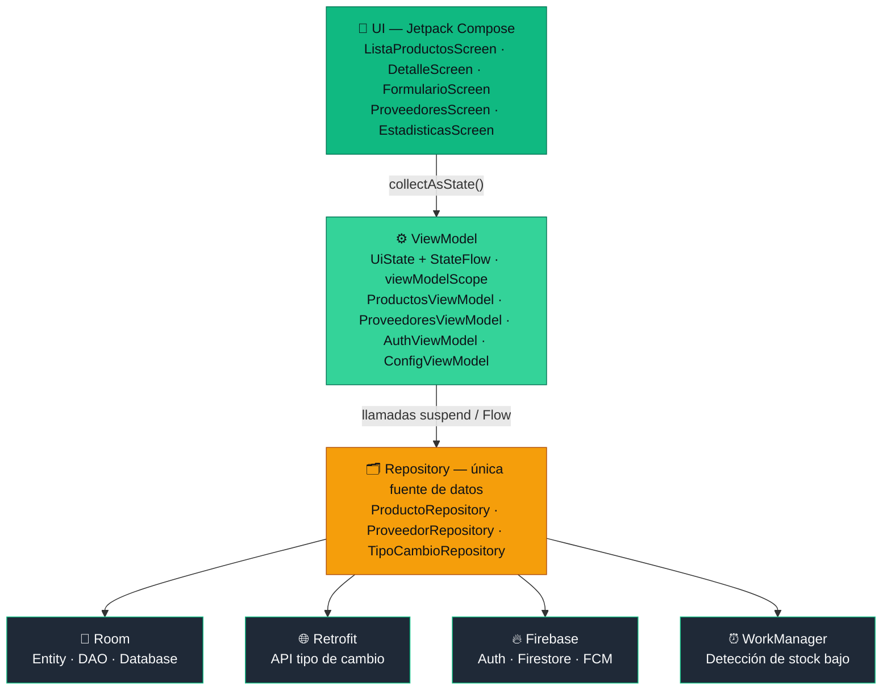

<div align="center">


<a href="https://github.com/your-org/TeToca">
  
</a>

<br/>


<br/>


</div>

<div align="center">

```diff
+ Aplicación móvil Android nativa para pequeños negocios
+ Detecta stock bajo automáticamente y notifica al dueño
+ Genera el pedido de reposición listo para enviar por WhatsApp
! Sin inventario centralizado, cada venta perdida es silenciosa
```

</div>

---

## 📍 Resumen del proyecto

<table>
<tr><td><b>Nombre</b></td><td>TeToca — Inventario inteligente con detección automática de stock bajo y reposición vía WhatsApp</td></tr>
<tr><td><b>Curso</b></td><td>Programación en Móviles</td></tr>
<tr><td><b>Institución</b></td><td>Instituto de Educación Superior Tecsup, Lima, Perú</td></tr>
<tr><td><b>Carrera</b></td><td>Diseño y Desarrollo de Software</td></tr>
<tr><td><b>Docente</b></td><td>Juan León</td></tr>
<tr><td><b>Ciclo / período</b></td><td>2026 - I</td></tr>
<tr><td><b>Temática</b></td><td>Propuesta propia, aprobada por el docente: Inventario inteligente</td></tr>
<tr><td><b>Plataforma</b></td><td>Android nativo (Kotlin + Jetpack Compose)</td></tr>
<tr><td><b>Paquete base</b></td><td><code>com.tetocaApp.tetoca</code></td></tr>
</table>

## 👥 Equipo

<table>
<tr>
<th align="center">Integrante</th>
<th align="center">Responsabilidad</th>
</tr>
<tr>
<td align="center"><b>Gabriel Llanos</b></td>
<td>Base del proyecto, entidades <code>Producto</code>/<code>Proveedor</code>, capa de datos (Room), navegación, vertical de Proveedores (CRUD)</td>
</tr>
<tr>
<td align="center"><b>William Julon</b></td>
<td>Vertical de Productos: configuración general, lista, detalle, formulario, integración de la API de tipo de cambio (Retrofit)</td>
</tr>
</table>

> Ambos integrantes conocen y pueden explicar el proyecto completo (UI, ViewModel, Repository y Room/Firebase), ya que la evaluación de sustentación es individual.

---

## 🎯 El problema que resuelve TeToca

En el Perú, la mayoría de los pequeños negocios de venta de productos manejan su inventario de forma manual o, en el mejor de los casos, con una hoja de cálculo. El control de stock se reduce a "mirar el estante" o anotar en una libreta lo que entra y lo que sale. Esto funciona mientras el catálogo es pequeño, pero en cuanto el negocio crece se vuelve casi imposible saber en tiempo real qué productos están por agotarse y a qué proveedor contactar para reponerlos.

El resultado más común es el **quiebre de stock (stockout)**: el cliente pide un producto, el negocio no lo tiene, y se pierde la venta — y muchas veces también al cliente.

<table>
<tr><td>🔍</td><td><b>Visibilidad incompleta del stock</b> — no hay una vista única de cuánto se tiene de cada producto, su punto de reorden ni quién es el proveedor que lo surte.</td></tr>
<tr><td>🔔</td><td><b>Ausencia de alertas proactivas</b> — ninguna herramienta avisa cuándo un producto está cerca de agotarse.</td></tr>
<tr><td>💬</td><td><b>Fricción al contactar proveedores</b> — redactar el pedido (qué, cuánto, a quién) toma tiempo que se resta a la atención del negocio.</td></tr>
</table>

TeToca centraliza el inventario, detecta automáticamente el stock bajo y reduce la fricción de reposición usando WhatsApp, el canal que estos negocios ya usan de forma natural con sus proveedores.

---

## 🎯 Objetivos

<details>
<summary><b>Objetivo general</b></summary>
<br/>

Desarrollar una aplicación móvil nativa para Android, denominada TeToca, que permita a pequeños negocios de venta de productos gestionar de forma centralizada su inventario y sus proveedores, y que detecte automáticamente los productos cuyo stock cae por debajo del mínimo configurado, generando un pedido de reposición mediante notificaciones inteligentes y contacto asistido (o automatizado) por WhatsApp, aplicando arquitectura MVVM, persistencia local con Room, sincronización en la nube con Firebase y consumo de servicios web mediante Retrofit.

</details>

<details>
<summary><b>Objetivos específicos</b></summary>
<br/>

1. Diseñar e implementar una interfaz de usuario íntegramente en Jetpack Compose, con al menos cuatro pantallas funcionales y navegación mediante Navigation Compose con paso de argumentos.
2. Aplicar el patrón arquitectónico MVVM, separando presentación (Composables), lógica de presentación (ViewModel) y datos (Repository), exponiendo el estado mediante `StateFlow` y un `data class UiState`.
3. Implementar un CRUD completo sobre las entidades principales —Producto y Proveedor— utilizando Room (`Entity`, `DAO`, `Database`).
4. Consumir un servicio web público mediante Retrofit (API de tipo de cambio) manejando correctamente los estados de carga y error.
5. Incorporar un mecanismo de detección automática de productos con stock bajo, basado en un punto de reorden configurable, ejecutado en segundo plano mediante WorkManager.
6. Integrar la generación de pedidos de reposición a través de WhatsApp mediante deep links.
7. Integrar Firebase Authentication, Cloud Firestore (sincronización por usuario) y notificaciones locales y push (FCM).
8. Personalizar la experiencia según el tipo de negocio (rubro), adaptando textos e iconos sin alterar la arquitectura subyacente.

</details>

---

## 📦 Alcance del proyecto

<details open>
<summary><b>✅ Incluido</b></summary>
<br/>

| Área | Funcionalidad |
|---|---|
| Gestión de productos | Crear, ver, editar y eliminar productos: nombre, categoría, stock actual, stock mínimo, precio y proveedor asociado |
| Gestión de proveedores | Registro y administración de proveedores (nombre, teléfono, notas) con el listado de productos que surten |
| Configuración por rubro | Selección del tipo de negocio en el onboarding; adaptación de textos e iconos; stock mínimo configurable, global o por producto |
| Consumo de API | Consulta del tipo de cambio actual vía Retrofit, útil para productos comprados en moneda extranjera |
| Detección de stock bajo | Tarea periódica en segundo plano (WorkManager) que identifica productos por debajo del stock mínimo |
| Reposición | Pantalla de productos por reponer, con mensaje precargado y apertura de WhatsApp mediante deep link al proveedor |
| Autenticación | Registro e inicio de sesión con correo y contraseña (Firebase Authentication), con persistencia de sesión |
| Sincronización | Productos y proveedores en Cloud Firestore, segmentados por UID del usuario autenticado |
| Notificaciones | Notificación local/push (FCM) "TeToca HOY" cuando uno o más productos caen por debajo del mínimo |
| Estadísticas | SKUs activos, valor total estimado del inventario y categoría con más rotación |

</details>

<details>
<summary><b>🚫 No incluido (fuera de alcance)</b></summary>
<br/>

- **Envío 100% automático de WhatsApp sin cuenta verificada de Meta** — por defecto se usa el flujo asistido por deep link; el envío sin intervención humana requiere WhatsApp Business Platform (Cloud API) verificada
- **Punto de venta (POS) y facturación** — no se registran ventas individuales ni se emiten comprobantes
- **Pasarela de pagos a proveedores** — no se procesan pagos ni se integran pasarelas (Stripe, Culqi, Mercado Pago)
- **Multiusuario por negocio** — cada cuenta gestiona un negocio individual, sin roles diferenciados entre empleados
- **Lectura de códigos de barras** — el registro de productos es manual
- **Versión iOS o web** — el alcance se limita a Android nativo

</details>

---

## 🗄️ Entidades y modelo de datos

TeToca modela su dominio con tres entidades principales y dos enumeraciones, persistidas localmente con Room y sincronizadas en Cloud Firestore.

<details>
<summary><b>🏢 Negocio (Configuración)</b></summary>
<br/>

| Campo | Tipo | Descripción |
|---|---|---|
| `id` | `Long` (PK) | Identificador autogenerado |
| `nombreNegocio` | `String` | Nombre del negocio |
| `rubro` | `Rubro` (enum) | `BODEGA`, `FERRETERIA`, `TALLER`, `BELLEZA`, `ABARROTES`, `OTRO` |
| `stockMinimoGlobal` | `Int` | Stock mínimo por defecto aplicado a nuevos productos |
| `modoReposicion` | enum | `ESTANDAR` o `AUTOMATIZADO` |
| `colorPrimario` | `String` | Color de acento de la interfaz |
| `ownerUid` | `String` | UID del usuario propietario (Firebase Authentication) |

</details>

<details>
<summary><b>🚚 Proveedor</b></summary>
<br/>

| Campo | Tipo | Descripción |
|---|---|---|
| `id` | `Long` (PK) | Identificador autogenerado |
| `nombre` | `String` | Nombre del proveedor |
| `telefono` | `String` | Teléfono con el que se genera el deep link de WhatsApp |
| `notas` | `String?` | Notas opcionales |
| `fechaRegistro` | `Long` | Timestamp de registro |
| `negocioId` | `Long` (FK) | Referencia al negocio propietario |

</details>

<details>
<summary><b>📦 Producto</b></summary>
<br/>

| Campo | Tipo | Descripción |
|---|---|---|
| `id` | `Long` (PK) | Identificador autogenerado |
| `nombre` | `String` | Nombre del producto |
| `categoria` | `String` | Categoría del producto |
| `stockActual` | `Int` | Cantidad actual en inventario |
| `stockMinimo` | `Int` | Punto de reorden: bajo este valor, el producto se marca "por reponer" |
| `precio` | `Double?` | Precio unitario (opcional, usado en estadísticas) |
| `proveedorId` | `Long?` (FK) | Referencia al proveedor que surte el producto |
| `negocioId` | `Long` (FK) | Referencia al negocio propietario |

</details>

**Relaciones:** un **Negocio** tiene muchos **Proveedores** (1→N); un **Proveedor** surte muchos **Productos** (1→N), vía la clave foránea `proveedorId`.

<details>
<summary><b>💾 Persistencia (Room + Firestore)</b></summary>
<br/>

- **Local (Room/SQLite):** `Entity` (`@Entity`), `DAO` (`@Dao`, con `@Insert/@Update/@Delete/@Query`, retornando `Flow`), y `Database` (`@Database`, singleton).
- **Nube (Cloud Firestore):**
  ```
  usuarios/{uid}/proveedores/{proveedorId}
  usuarios/{uid}/productos/{productoId}
  usuarios/{uid}/config/negocio
  ```
  Reforzada con reglas de seguridad que verifican `request.auth.uid` contra el `{uid}` de la ruta. Room actúa como caché local; los conflictos se resuelven con el criterio de última escritura.

</details>

---

## 📱 Pantallas de la aplicación

<table>
<tr><th>Pantalla</th><th>Descripción</th></tr>
<tr><td><code>ListaProductosScreen</code></td><td>Lista de productos (<code>LazyColumn</code>, vía <code>Flow</code>/<code>StateFlow</code>) con indicador de color según nivel de stock 🟢🟡🔴. Botón flotante para crear producto.</td></tr>
<tr><td><code>DetalleScreen</code></td><td>Recibe <code>productoId</code> como argumento de navegación; muestra los datos completos y permite editar/eliminar.</td></tr>
<tr><td><code>FormularioScreen</code></td><td>Crear o editar un producto. Muestra el tipo de cambio actual (Retrofit) como referencia para productos importados.</td></tr>
<tr><td><code>ProveedoresScreen</code></td><td>CRUD completo de proveedores y listado de productos que surte cada uno.</td></tr>
<tr><td><code>ProductosPorReponer</code></td><td>Lista de productos con stock bajo, con botón de contacto directo por WhatsApp hacia el proveedor.</td></tr>
<tr><td><code>EstadisticasScreen</code></td><td>SKUs activos, valor total estimado y categoría con mayor rotación; acceso a configuración.</td></tr>
</table>

La navegación entre pantallas usa **Navigation Compose** con paso de argumentos (ej. `productoId` de la lista al detalle).

---

## 🏗️ Arquitectura (MVVM)

<div align="center">



</div>

El flujo: el usuario actúa en un Composable → llama a una función del ViewModel → el ViewModel, en su `viewModelScope`, llama al Repository → el Repository obtiene el dato (Room y/o remoto) → el ViewModel actualiza su `StateFlow` → el Composable, que observa con `collectAsState()`, se recompone automáticamente.

---

## 🔁 Modo dual de reposición

> Tener "WhatsApp Business" no es lo mismo que tener acceso a la **WhatsApp Business Platform (Cloud API)** de Meta — la única vía habilitada para enviar mensajes sin intervención humana, y que requiere RUC y verificación de empresa.

<table>
<tr><th>Modo</th><th>Condición</th><th>Comportamiento</th></tr>
<tr>
<td>🟢 <b>Estándar</b><br/>(deep link)</td>
<td>Por defecto, no requiere cuenta adicional</td>
<td>WorkManager detecta stock bajo y notifica al dueño. El dueño pulsa "WhatsApp" por producto: se abre la app con el pedido redactado, y confirma con un toque.</td>
</tr>
<tr>
<td>🟡 <b>Automatizado</b><br/>(Cloud API)</td>
<td>Cuenta de WhatsApp Business Platform verificada con Meta</td>
<td>WorkManager envía el pedido directamente al proveedor sin intervención del dueño. Si falla, degrada automáticamente al modo estándar.</td>
</tr>
</table>

El "modo automatizado" es una implementación adicional de la misma interfaz de reposición (`ReposicionSender`), seleccionada en tiempo de ejecución — una extensión natural del diseño, no un componente paralelo.

---

## 🛠️ Tecnologías utilizadas

<div align="center">


</div>

| Componente | Tecnología | Rol en el proyecto |
|---|---|---|
| Lenguaje | Kotlin 2.2.10 | Lenguaje principal, recomendado por Google para Android |
| Interfaz | Jetpack Compose | Construcción declarativa de toda la UI |
| Diseño visual | Material Design 3 | Componentes, color y tipografía |
| Navegación | Navigation Compose | Navegación entre pantallas con paso de argumentos |
| Arquitectura | MVVM + StateFlow | Separación en capas y estado reactivo |
| Persistencia local | Room (SQLite) | Almacenamiento local y CRUD; caché sin conexión |
| Cliente HTTP | Retrofit + OkHttp | Consumo de la API REST de tipo de cambio |
| Serialización | Gson / Moshi | Conversión de JSON a objetos Kotlin |
| Autenticación | Firebase Authentication | Registro, login y sesión por correo/contraseña |
| Base de datos en nube | Cloud Firestore | Sincronización segmentada por UID |
| Mensajería | Firebase Cloud Messaging | Notificaciones push |
| Tareas en segundo plano | WorkManager | Detección periódica de stock bajo |
| Concurrencia | Coroutines + Flow | Operaciones asíncronas sin bloquear el hilo principal |
| API externa | [Frankfurter](https://frankfurter.dev) | API gratuita de tipo de cambio, sin key ni cuotas |

<details>
<summary><b>📋 Versiones específicas del proyecto</b></summary>
<br/>

- **AGP (Android Gradle Plugin):** 9.1.1
- **Kotlin:** 2.2.10
- **Compose BOM:** 2026.02.01
- **compileSdk / targetSdk:** 36
- **minSdk:** 24 (Android 7.0)
- **Java compatibility:** 11
- **core-ktx:** 1.18.0
- **lifecycle-runtime-ktx:** 2.10.0
- **activity-compose:** 1.13.0

</details>

---

## 📂 Estructura de paquetes

```
com.authfirebaseappjulon.tetoca
├── ui/
│   ├── productos/     (ListaProductosScreen, DetalleScreen, FormularioScreen)
│   ├── proveedores/   (ProveedoresScreen, ProductosPorReponer)
│   ├── auth/           (login, registro)
│   └── theme/          (Color.kt, Theme.kt, Type.kt — Material 3)
├── viewmodel/          (ProductosViewModel, ProveedoresViewModel, AuthViewModel, ConfigViewModel)
├── data/
│   ├── local/          (Entity, DAO, Database — Room)
│   ├── remote/          (Retrofit, Firestore)
│   └── repository/      (ProductoRepository, ProveedorRepository, TipoCambioRepository)
├── domain/              (lógica de negocio: detección de stock bajo)
├── navigation/           (NavGraph y rutas)
└── work/                 (WorkManager: tarea de detección)
```

---

## ⚙️ Requisitos del entorno

| Requisito | Versión / Detalle |
|---|---|
| Android Studio | Ladybug (2024.2) o superior |
| JDK | JDK 17 |
| Android SDK | minSdk 24 · compileSdk/targetSdk 36 |
| Kotlin | 2.2.10 |
| Dispositivo de prueba | Emulador o físico con Android 7.0+ y Google Play Services |
| Cuenta | Proyecto de Firebase con Auth, Firestore y FCM habilitados (Parte 2) |

## 🚀 Instalación y ejecución

```bash
git clone <url-del-repositorio>
```

1. Abrir la carpeta en Android Studio y esperar la sincronización de Gradle.
2. (Parte 2) Colocar `google-services.json` en `app/`.
3. Conectar emulador o dispositivo físico.
4. **Run ▶** o generar APK con `Build > Build APK(s)`.
5. (Parte 2) Probar notificaciones desde la consola de Firebase Cloud Messaging.

---

## 🗓️ Plan de entregas

<table>
<tr><th>Entrega</th><th>Fecha</th><th>Contenido exigido</th></tr>
<tr>
<td>🟢 <b>Parte 1</b><br/>Aplicación local (MVVM)</td>
<td><b>18 jun 2026</b></td>
<td>Compose (4+ pantallas), Navigation con argumentos, MVVM, CRUD Room (Producto + Proveedor), Retrofit con loading/error, patrón Repository</td>
</tr>
<tr>
<td>🟡 <b>Parte 2</b><br/>Firebase y notificaciones</td>
<td><b>25 jun 2026</b></td>
<td>Firebase Auth, Firestore por UID, notificación local y push, entidad Negocio, Estadísticas/Config, modo dual de reposición</td>
</tr>
</table>

> El detalle día por día de la división de tareas está en [`context.md`](./context.md).

---

## 🌿 Convención de ramas y commits

**Ramas:** `main` (estable) · `parte-1` (Parte 1) · `parte-2` (Parte 2)

```
tipo(alcance): descripción breve en español
```

- **tipo:** `feat` `fix` `refactor` `ui` `data` `docs` `chore`
- **alcance:** `producto` `proveedor` `negocio` `nav` `config` `tema`
- **ejemplo:** `feat(producto): agrega ListaProductosScreen con ProductosViewModel`

---

## ✅ Pruebas

- Crear, editar y eliminar un producto; verificar persistencia tras reabrir la app
- Consumir la API de tipo de cambio con y sin conexión, verificando loading/error
- Registrar salida de stock que deje un producto bajo el mínimo → aparece en "por reponer" + notificación
- Verificar separación de datos por UID entre usuarios distintos *(Parte 2)*
- Verificar notificaciones push en primer y segundo plano *(Parte 2)*

---

## 🔮 Trabajo futuro

```yaml
Próximas mejoras:
  - Orquestación externa con n8n (consolidación de pedidos, reportes)
  - Lectura de códigos de barras / QR
  - Módulo de punto de venta (POS) básico
  - Soporte multiusuario con roles
  - Predicción de demanda por rotación histórica
```

---

## 📚 Referencias

- Google — [Guide to app architecture](https://developer.android.com/topic/architecture)
- Google — [Jetpack Compose documentation](https://developer.android.com/jetpack/compose)
- Google — [Room persistence library](https://developer.android.com/training/data-storage/room)
- Google — [WorkManager](https://developer.android.com/topic/libraries/architecture/workmanager)
- Firebase — [Documentation](https://firebase.google.com/docs)
- Square — [Retrofit](https://square.github.io/retrofit/)
- [Frankfurter — Free exchange rates API](https://frankfurter.dev)
- Meta — [WhatsApp Business Platform](https://developers.facebook.com/docs/whatsapp)

---

<div align="center">

📄 Documentación adicional: [`context.md`](./context.md) · Expediente técnico (`TeToca-Expediente-Tecnico.docx`)

<br/>


</div>
